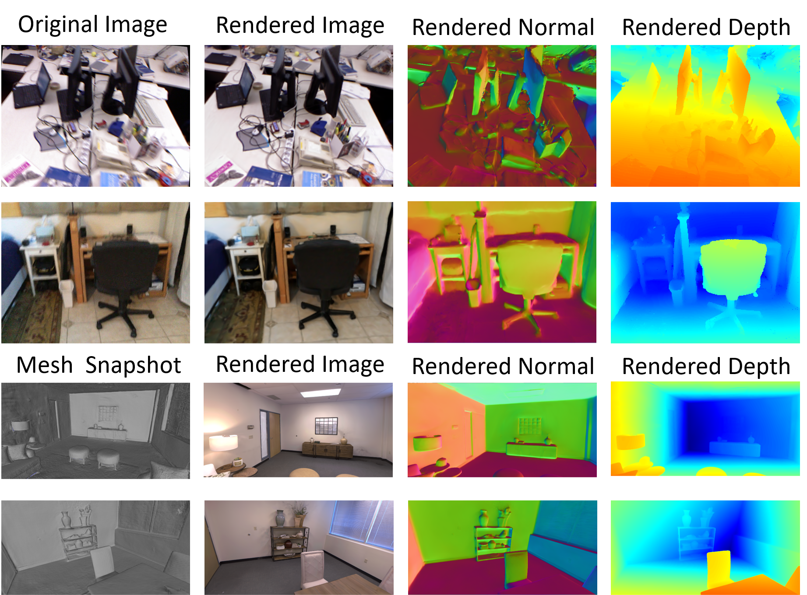

<!-- PROJECT TITLE -->
<h1 align="center">
  <span style="font-size:24px; font-weight:bold;">DAGS: Deblur-Aware Gaussian Splatting <br> Simultaneous Localization and Mapping</span>
</h1>
<p align="center">
  
</p>


<!-- TABLE OF CONTENTS -->
<details open="open" style='padding: 10px; border-radius:5px 30px 30px 5px; border-style: solid; border-width: 1px;'>
  <summary>Table of Contents</summary>
  <ol>
    <li>
      <a href="#installation">Installation</a>
    </li>
    <li>
      <a href="#run">Run</a>
    </li>
    <li>
      <a href="#acknowledgement">Acknowledgement</a>
    </li>
    <li>
      <a href="#citation">Citation</a>
    </li>
    <li>
      <a href="#contact">Contact</a>
    </li>
  </ol>
</details>


## Installation
1. Clone the repo. 
```bash
git clone  https://github.com/Howie-Ye/DAGS.git
cd DAGS
```
2. Creating a new Conda environment.
```bash
conda create --name dags python=3.10
conda activate dags
```
Or use an existing environment and supplement the necessary libraries according to the **environment.yaml** file. **PyTorch==2.0.1** is required for the **Metric3D** environment. 
```bash
python -m pip install -r requirements.txt
```

3. Now install the droid backends and lietorch.
```bash
python -m pip install -e .
```


## Data Download

### Replica
Download the data as below and the data is saved into the `./datasets/Replica` folder. Note that the Replica data is generated by the authors of iMAP (but hosted by the authors of NICE-SLAM). Please cite iMAP if you use the data.
```bash
bash scripts/download_replica.sh
```
To be able to evaluate the reconstruction error, download the ground truth Replica meshes where unseen region have been culled.

```bash
bash scripts/download_cull_replica_mesh.sh
```

### TUM-RGBD
```bash
bash scripts/download_tum.sh
```
Please change the `input_folder` path in the scene specific config files to point to where the data is stored.


### ScanNet
Please follow the data downloading procedure on the [ScanNet](http://www.scan-net.org/) website, and extract color/depth frames from the `.sens` file using this [code](https://github.com/ScanNet/ScanNet/blob/master/SensReader/python/reader.py).

<details>
  <summary>[Directory structure of ScanNet (click to expand)]</summary>
  
  Please change the `input_folder` path in the scene specific config files to point to where the data is stored.

```
  DATAROOT
  └── scannet
        └── scene0000_00
            └── frames
                ├── color
                │   ├── 0.jpg
                │   ├── 1.jpg
                │   ├── ...
                │   └── ...
                ├── depth
                │   ├── 0.png
                │   ├── 1.png
                │   ├── ...
                │   └── ...
                ├── intrinsic
                └── pose
                    ├── 0.txt
                    ├── 1.txt
                    ├── ...
                    └── ...
```
</details>


We use the following sequences: 
```
scene0000_00
scene0059_00
scene0106_00
scene0169_00
scene0181_00
scene0207_00
```

## Run
For running DAGS, each scene has a config folder, where the `input_folder`,`output` paths need to be specified. Below, we show some example run commands for one scene from each dataset.

### Replica
To run DAGS on the `room0` scene, run the following command. 
```bash
python run.py configs/Replica/room0.yaml
```
After reconstruction, the trajectory error will be evaluated and so will the mesh accuracy along with the rendering metrics.

### TUM-RGBD
To run DAGS on the `freiburg1_desk` scene, run the following command. 
```bash
python run.py configs/TUM_RGBD/freiburg1_desk.yaml
```
After reconstruction, the trajectory error will be evaluated automatically.

### ScanNet

To run DAGS on the `scene0000_00` scene, run the following command. 
```bash
python run.py configs/Scannet/scene0000.yaml
```
After reconstruction, the trajectory error will be evaluated automatically.

## Run tracking without mapping
Our DAGS pipeline uses two processes, one for tracking and one for mapping, and it is possible to run tracking only without mapping/rendering. Add `--only_tracking` in each of the above commands.
```bash
python run.py configs/Replica/room0.yaml --only_tracking
```
To run the commands with other arguments, please refer to **run.py** for more details.


## Acknowledgement
Our codebase is partially based on [GlORIE-SLAM](https://github.com/zhangganlin/GlORIE-SLAM), [GO-SLAM](https://github.com/youmi-zym/GO-SLAM), [DROID-SLAM](https://github.com/princeton-vl/DROID-SLAM) and [MonoGS](https://github.com/muskie82/MonoGS). We thank the authors for making these codebases publicly available. Our work would not have been possible without your great efforts!

## Reproducibility
There may be minor differences between the released codebase and the results reported in the paper. Further, we note that the GPU hardware has an influence, despite running the same seed and conda environment.

